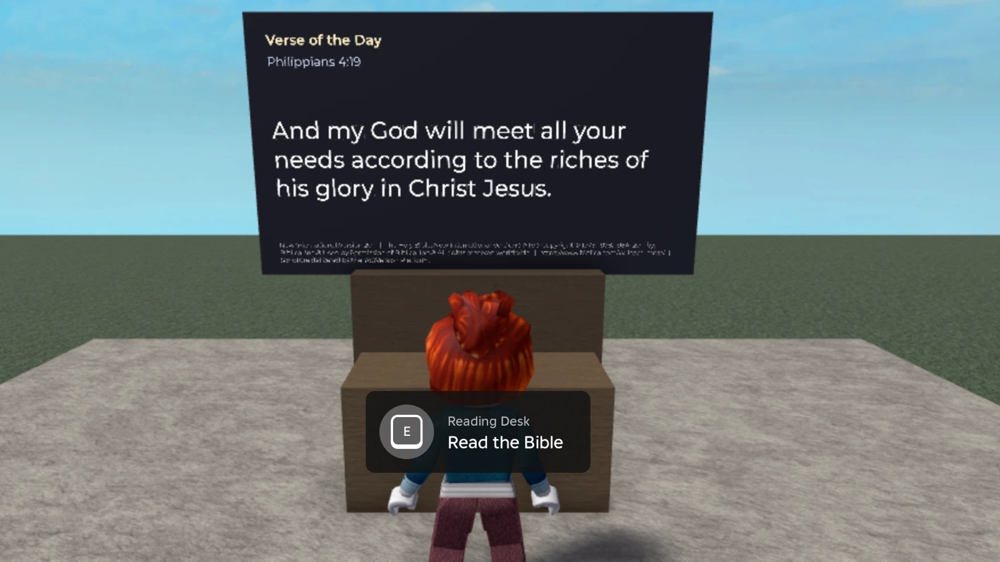

# Scripture Kiosk: a YouVersion Platform example for Roblox

### ▶ [Play Scripture Kiosk on Roblox](https://www.roblox.com/games/82686984547483/Scripture-Kiosk)

[](https://www.roblox.com/games/82686984547483/Scripture-Kiosk)

This repository is the source for a live, public Roblox experience. Try it
first, then read how it works.

A small Roblox experience that reads the Bible from the
[YouVersion Platform](https://platform.youversion.com) API. It has two parts:

- **A Verse of the Day board** that every player sees, with no interaction.
- **A reading desk** that opens a full Bible reader: every book and chapter,
  a version picker, verse numbers, poetry formatting, section headings,
  words of Jesus, and footnotes.

Publisher attribution is shown with the text wherever Scripture appears.

This is an independent example. It is not an official YouVersion product.

## Why this is an interesting example

Roblox differs from web and mobile in ways that shape the whole integration:

| Web/mobile assumption | Roblox reality | What this example does |
|---|---|---|
| The client calls the API | Only servers can make HTTP requests | All API calls happen server-side; clients use a RemoteFunction |
| One process, one cache | Many servers per experience, no shared state | A server-wide cache means all players on a server share one fetch |
| HTML and CSS | RichText with about six tags | Parses the Platform's HTML into blocks, renders with RichText |
| Clickable links | No hyperlinks in a TextLabel | Publisher URLs are shown as text |
| Secrets in env vars | Secrets Store, domain-pinned | The app key is a Roblox Secret that can only be sent to `api.youversion.com` |

## Requirements

- A YouVersion Platform app and its app key, from
  [platform.youversion.com](https://platform.youversion.com)
- [Rojo](https://rojo.space) and [Luau](https://luau.org) (`brew install rojo luau`)
- Node.js 18+ for the live tests and tools
- Roblox Studio, once, to create the experience

## Setup

1. **Build the place.**

   ```bash
   ./tools/build.sh
   ```

   This runs the syntax check and unit tests, builds
   `build/ScriptureKiosk.rbxlx`, and refuses to ship if anything
   credential-shaped is in the file.

2. **Publish it once from Studio.** Open `build/ScriptureKiosk.rbxlx` and use
   **File → Publish to Roblox As…**. Roblox has no API for creating a new
   experience, so this first publish has to come from Studio.

3. **Allow HTTP requests.** In Studio, **File → Experience Settings →
   Security → Allow HTTP Requests**. Setting `HttpService.HttpEnabled` in the
   project file is not enough; Roblox uses the experience setting.

4. **Add the app key as a secret.** In Creator Hub, open your experience,
   then **Secrets → Create Secret**:

   - Name: `YVP_APP_KEY`
   - Secret: your YouVersion Platform app key
   - Domain: `api.youversion.com`

   The domain pin means Roblox refuses to send the key anywhere else, even if
   code tries to.

5. **Join the experience.** The board should show today's verse. If it
   doesn't, press F9: the server log prints a startup self-check naming the
   problem and its fix.

For testing in Studio, where the Secrets Store isn't available, create an
uncommitted ModuleScript at `ServerStorage.DevSecrets` returning
`{ YVP_APP_KEY = "..." }`. Delete it before publishing.

## Publishing updates without Studio

After the first publish, updates go through Roblox Open Cloud. Create an API
key at [create.roblox.com/dashboard/credentials](https://create.roblox.com/dashboard/credentials)
with `universe-places` **write**, restricted to your experience.

```bash
export ROBLOX_API_KEY=...        # Open Cloud key
export ROBLOX_UNIVERSE_ID=...    # from the Creator Hub URL
export ROBLOX_PLACE_ID=...       # the start place
./tools/publish.sh               # test, build, publish live
./tools/publish.sh Saved         # publish a draft instead
```

A failing test blocks the publish. If Studio has the place open, Roblox
returns 409; the script retries with backoff.

When editing an Open Cloud key, add the **operations** (read/write) after
setting the experience restriction. Toggling the restriction clears any
operations already selected, and a key with no operations fails every call
with "Scope not authorized".

`tools/upload-thumbnail.sh <image.jpg>` uploads a Home Page thumbnail through
the Thumbnail Personalization API. It needs `universe-thumbnail` read and
write. You may still need to activate the thumbnail in Creator Hub, and the
Experience Detail Page image and the icon are set in Creator Hub.

## Commands

| Command | What it does | Needs |
|---|---|---|
| `./tools/test.sh` | Syntax check, UI overlay check, unit tests | nothing |
| `./tools/build.sh` | Tests, then build, then credential scan | nothing |
| `./tools/publish.sh` | Build and publish via Open Cloud | `ROBLOX_*` |
| `node tests/integration/contract.mjs` | Live contract test | `YVP_APP_KEY` |
| `node tests/integration/parser-integrity.mjs` | Proves parsing loses no characters | `YVP_APP_KEY` |
| `node tests/integration/votd.mjs` | Live Verse of the Day check | `YVP_APP_KEY` |
| `node tools/check-versions.mjs` | Checks every configured version is readable | `YVP_APP_KEY` |
| `node tools/fetch-books.mjs [bibleId]` | Regenerates the book table | `YVP_APP_KEY` |

The live checks default to version 206 (World English Bible). Use
`BIBLE_IDS=206,111` or `VOTD_BIBLE_ID=...` to test other versions your app
key can access.

## Configuration

`src/shared/Config.luau` holds everything tunable: the versions offered, the
Verse of the Day version, cache lifetimes, and the per-server request budget.
It ships with public-domain and Creative Commons versions. Licensed versions
work the same way once your Platform app has accepted their licence, but each
publisher has its own display terms. Read them for your surface before
enabling one.

## Things that took a while to find

Recorded here so you don't have to find them again:

- **`HttpService` has no `request` method; it's `RequestAsync`.** The client
  takes an injected transport, and `YvpClient.new` rejects one without a
  callable `request`, so a wiring mistake fails at startup instead of looking
  like an outage.
- **A SurfaceGui on `NormalId.Front` faces −Z.** If your board looks blank,
  check which way it faces.
- **`SurfaceGui.SizingMode` defaults to `PixelsPerStud`, which ignores
  `CanvasSize`.** Set `FixedSize` if you lay out for a canvas size.
- **Z-order.** Under Global Z-index behaviour, children of a raised overlay
  draw behind their parent. The ScreenGui sets `ZIndexBehavior.Sibling`, and
  `tools/check-ui-overlays.py` checks it statically.
- **Verse ranges.** `ISA.43.18-19` works; `JHN.3.16-JHN.3.17` returns 404.
  Verse of the Day uses the first form for some days.
- **Successful responses carry no rate-limit headers, but a 429 carries
  `Retry-After`.** The client honours it and won't sleep out a long penalty
  inside a player request.
- **Some glyphs don't render in Roblox UI fonts** (for example `▾`). Use
  ASCII in UI chrome.

## Scripture and attribution

- Scripture text is displayed exactly as the Platform returns it. Escaping for
  RichText changes no visible character, and tests assert this.
- Every passage is shown with its version title, copyright notice and
  publisher link from live metadata, plus a YouVersion Platform credit.
- Footnotes are one click away rather than inline, so editorial notes are
  never read as Scripture.
- The only Scripture in this repository is two short test fixtures from the
  World English Bible, which is public domain: John 3:16 and a phrase from
  Psalm 117. Everything else is fetched at runtime.

## Licence

The code is released under the MIT licence; see `LICENSE`. That covers this
repository's code only. Bible text is supplied at runtime by the YouVersion
Platform under each publisher's own terms, which your app must follow.
